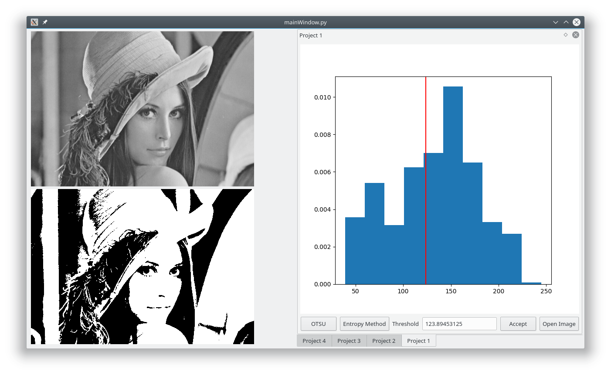
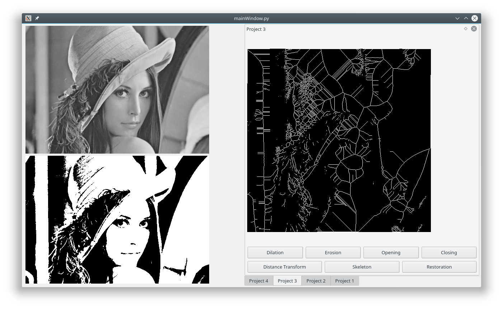
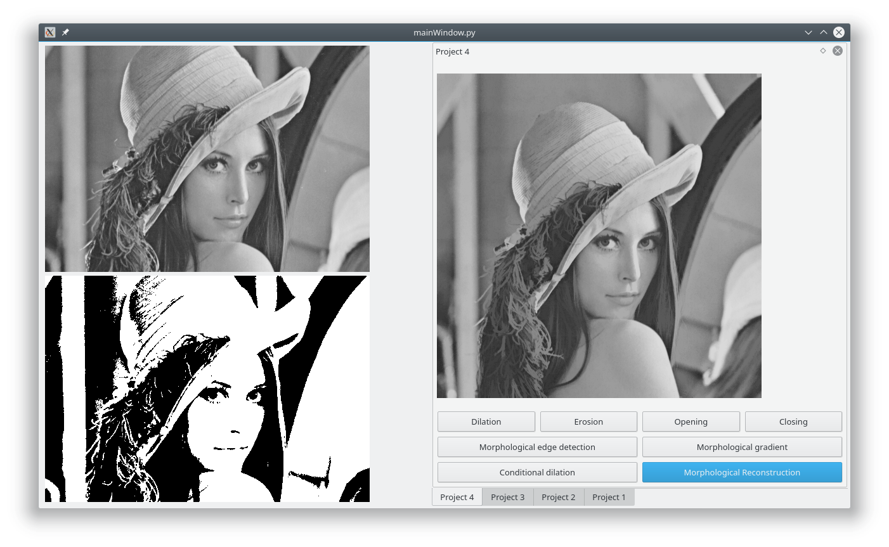

# SJTU_BME_DIP
Project for course Advanced Biomedical Image Processing (高级生物医学图像处理), 
School of Biomedical Engineering (生物医学工程学院), 
Shanghai Jiao Tong University (上海交通大学)

# Functions
see Requirements.md for details

# Dependency
* python3-pyqt5
* python3-scipy
* python3-skimage
* python3-opencv
* python3-matplotlib

# Usage
just run `python3 ./mainWindow.py`

# screenshots

